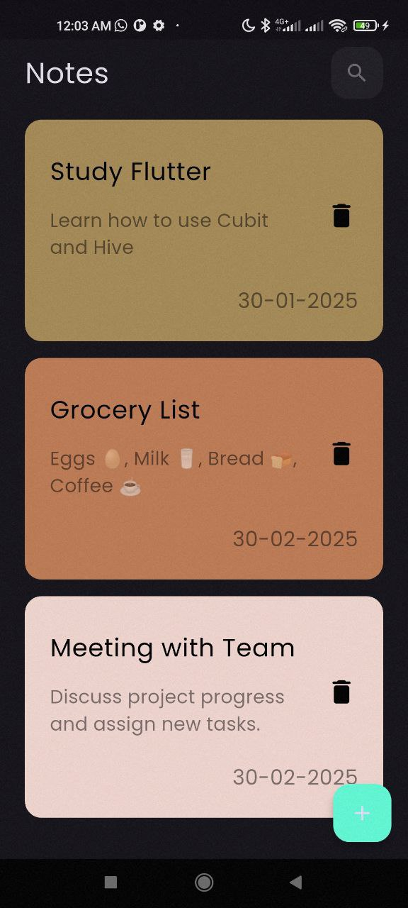
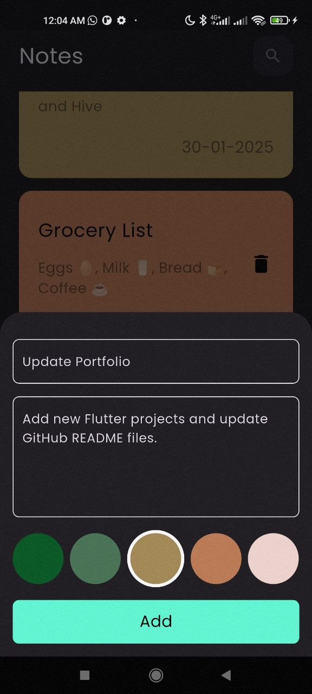
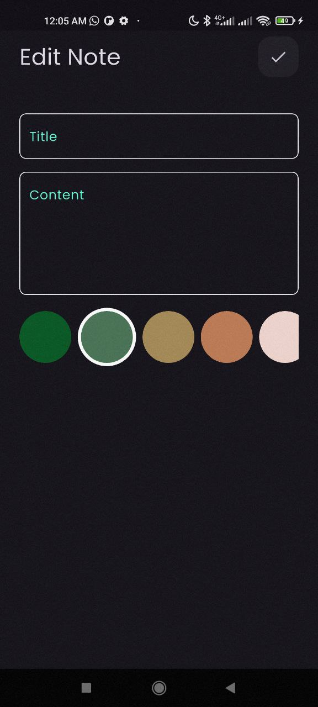

# 📝 Notes App

A simple and fast mobile notes application built with **Flutter**.  
It allows users to add, edit, and delete notes, with local storage using **Hive**, and state management via **Cubit (Bloc)**.

---

## 📸 Screenshots

| Home Screen | Add Note | Edit Note |
|-------------|----------|------------|
|  |  |  |

---

## 🚀 Features

- 📝 Add a title and content to each note
- 🎨 Choose a custom color for each note
- ✏️ Edit existing notes (title, content, color)
- 🗑️ Delete notes with a single tap
- 📦 Local data storage using Hive
- ⚙️ Lightweight state management with Cubit (Bloc)

---

## 🛠️ Built With

- [Flutter](https://flutter.dev )
- [Dart](https://dart.dev )
- [Hive](https://docs.hivedb.dev ) (for local storage)
- [Bloc/Cubit](https://bloclibrary.dev )

---

## 📂 Note Data Model

```dart
class NoteModel {
  final String title;
  final String content;
  final int color;
  final DateTime date;
}

---

## 📸 Screenshots

| Home Screen | Add Note | Edit Note |
|-------------|----------|------------|
|  |  |  |

---

## 🚀 Features

- 📝 Add a title and content to each note
- 🎨 Choose a custom color for each note
- ✏️ Edit existing notes (title, content, color)
- 🗑️ Delete notes with a single tap
- 📦 Local data storage using Hive
- ⚙️ Lightweight state management with Cubit (Bloc)

---

## 🛠️ Built With

- [Flutter](https://flutter.dev )
- [Dart](https://dart.dev )
- [Hive](https://docs.hivedb.dev ) (for local storage)
- [Bloc/Cubit](https://bloclibrary.dev )

---

## 📂 Note Data Model

```dart
class NoteModel {
  final String title;
  final String content;
  final int color;
  final DateTime date;
}

